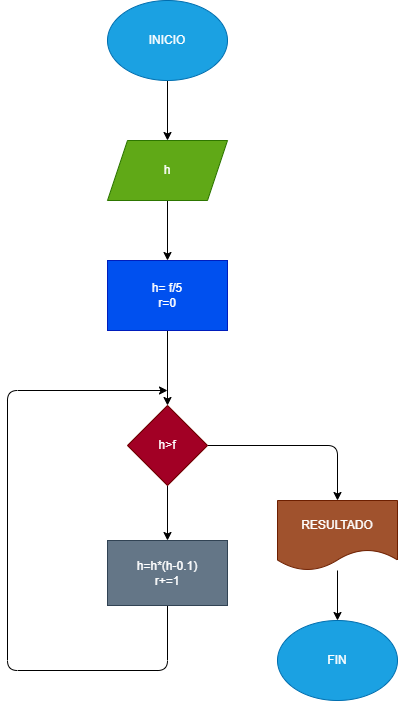

# una-pelota
Una pelota se deja caer desde un altura h, y en cada rebote sube el 10%menos que el anterior, hacer el diagrama y programa en Python, que lea h y que calcule e imprima en cual rebote la pelota o alcanza a subir la quinta parte de la altura inicial
## Diagrama  de flujo
